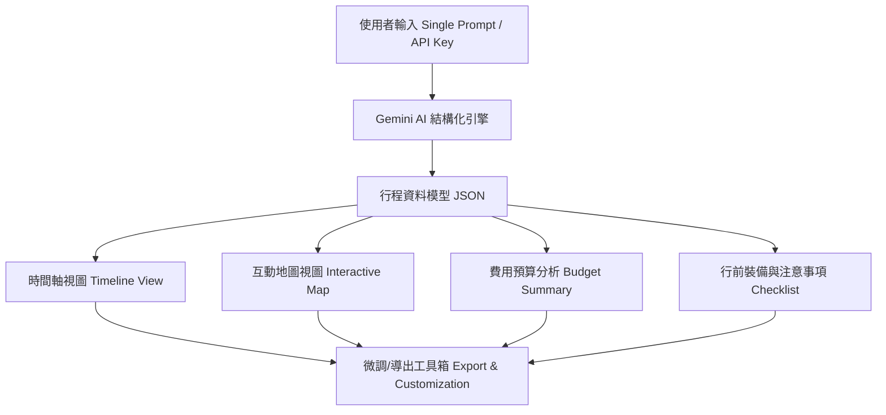

# 旅遊行程規劃 App 功能規格書 (Functional Specification Document)

> **專案名稱**：AI 智慧旅遊規劃器 (Smart AI Travel Planner)  
> **核心定位**：極簡、直覺、基於單一提示詞（Single Prompt）的 AI 旅遊行程規劃工具  
> **核心 AI 技術**：Google AI Studio API (Gemini API)  
> **版本**：v1.0.0  

---

## 1. 產品概述與設計理念 (Product Overview & Design Philosophy)

### 1.1 產品簡介
本應用程式旨在打破傳統旅遊規劃工具繁複、欄位過多、操作複雜的痛點。使用者只需輸入**一句話（單一提示詞 Prompt）**（例如：「想去東京 5 天 4 夜，喜歡動漫與在地美食，預算 4 萬台幣」），系統即結合 **Google AI Studio (Gemini API)** 的強大推理與結構化輸出能力，在幾秒鐘內自動生成一份包含每日行程時間軸、互動地圖、費用預算估算與行前檢查清單的完整旅遊規劃。

### 1.2 設計原則
1. **極簡操作 (Ultra-Simple)**：零學習成本，單一輸入框即可啟動完整規劃，不強迫填寫繁複的選單。
2. **全套實用功能 (Full-Featured Core)**：雖操作簡單，但具備行程時間軸、動態地圖、預算統計、行李清單、行事曆匯出等完整旅遊所需功能。
3. **高彈性微調 (High Flexibility)**：支援對特定天數或景點提出自然語言修改要求（如：「把第三天下午改為室內備案」）。
4. **隱私與安全 (Privacy-First)**：API Key 於使用者端本機儲存與呼叫，不經過額外的第三方伺服器。

---

## 2. 核心功能規格與模組劃分 (Core Architecture & Features)



### 2.1 API 金鑰管理與 AI 引擎設定 (API & AI Core)
- **Google AI Studio API Key 設定**：
  - 首次開啟 App 或設定頁面時，提示使用者設定 Google AI Studio API Key。
  - 金鑰自動加密儲存於瀏覽器 `LocalStorage`，提供測試連線（Test Connection）按鈕。
- **Gemini 模型對接**：
  - 預設使用 **Gemini 2.5 Flash** / **Gemini 1.5 Flash**（兼具高性價比與極快響應速度）。
  - 使用 `response_schema` 強制 Gemini 回傳結構化 JSON，確保 100% 解析成功率。

---

### 2.2 核心輸入介面 (Single-Prompt Input Interface)

#### 頁面元件：
1. **主要輸入框 (Hero Prompt Input)**：
   - 多行自然語言輸入框，預設 Prompt Placeholder（例：「下個月想去關西 6 天 5 夜，偏好古蹟與拉麵，2 人同行」）。
   - 快速範例按鈕 (Prompt Chips)：點擊可自動帶入精選範例（如：「京阪神浪漫 5 日遊」、「北海道雪季 7 日自駕」、「台北 3 天 2 夜文青美食」）。
2. **快速輔助選單 (快捷膠囊 Chips, 可選填)**：
   - 目的地 (Destination)
   - 天數 (Duration: 1-14 天)
   - 旅遊風格 (Vibe: 美食、文化、放鬆、購物、戶外、親子)
   - 預算層級 (Budget: 節省、適中、奢華)
   *註：點擊選單會自動組合文字注入主要輸入框中，不破壞單一提示詞的體驗。*
3. **一鍵生成按鈕 (Generate Button)**：
   - 點擊後啟動 AI 規劃，顯示充滿科技與旅遊質感的 Loading 動畫與動態提示（如：「正在尋找在地隱藏美食...」、「正在優化景點間交通路線...」）。

---

### 2.3 行程展示與多維視圖 (Multi-View Itinerary Explorer)

生成行程後，畫面進入主工作區，提供 4 大核心視圖切換：

#### (1) 行程時間軸視圖 (Timeline / Daily Schedule View)
- **Day-by-Day 分頁標籤**：動態顯示「Day 1」、「Day 2」... 及每日主題摘要（如：「Day 1: 抵達東京 & 澀谷夜景探險」）。
- **時間點卡片 (Timeline Card)**：
  - 時間標籤（如：09:00 - 11:00）
  - 景點/活動名稱與分類 Icon（景點 🏛️、美食 🍜、購物 🛍️、交通 🚃、住宿 🏨）
  - 詳細說明、在地小貼士（Tips）
  - 預估停留時間與預估費用 (Estimated Cost)
  - 一鍵開啟 Google 地圖導航外部連結 🗺️

#### (2) 全景互動地圖視圖 (Interactive Map View)
- **地圖標記 (Map Markers)**：以不同顏色數字標籤呈現每日景點順序。
- **路線連線 (Route Lines)**：畫出每日景點間的建議移動順序連線。
- **卡片連動 (Card Hover Linkage)**：點擊地圖標記會高亮對應的時間軸卡片；反之亦然。

#### (3) 費用預算統計視圖 (Budget Breakdown View)
- **總費用預估圖表**：將 AI 估算之費用分類呈現（交通、住宿、餐飲、門票購物）。
- **幣換算與人均預算**：自動轉換為當地貨幣及每人平均花費。

#### (4) 行前準備與清單視圖 (Toolkit & Packing Checklist)
- **智慧行李檢查表 (Smart Packing List)**：AI 根據目的地氣候與活動自動生成的準備清單（如：證件、特有電壓轉接頭、雨具、保暖衣物）。
- **簽證與旅遊須知 (Travel Tips & Warnings)**：插座類型、入境須知、緊急求助電話、推薦網卡類型。

---

### 2.4 行程微調與個人化編輯 (Customization & Re-Prompting)

1. **AI 自然語言對話微調 (Re-Prompting / AI Assistant)**：
   - 行程下方提供 AI 微調輸入框（如：「第二天的行程太多了，幫我刪除一個景點並加入咖啡廳休息」、「把第四天改為備案雨天行程」）。
   - AI 將重新優化並僅更新相關天數的數據。
2. **手動卡片編輯 (Manual Edits)**：
   - 刪除景點 (Delete Event)
   - 上下拖曳調整時間順序 (Drag & Drop Reordering)
   - 新增自訂景點卡片 (Add Custom Node)

---

### 2.5 匯出、分享與儲存 (Export & Storage)

1. **行事曆同步 (.ics Export)**：
   - 一鍵匯出成 `.ics` 檔案，可直接匯入 Google Calendar、Apple Calendar 或 Outlook。
2. **PDF / 圖文匯出 (PDF & Print Friendly)**：
   - 格式化導出適合手機閱讀或列印的 PDF 行程表。
3. **本地歷史紀錄 (Saved Trips / Local History)**：
   - 自動將規劃好的行程儲存於瀏覽器，使用者隨時可離線查看、複製或刪除舊行程。
4. **文字/連結分享 (Copy / Share)**：
   - 一鍵複製精簡版文字行程至 LINE / Messenger，方便與同行好友討論。

---

## 3. Gemini API Prompt 規範與 JSON 資料結構 (Data Schema)

為確保 Google AI Studio API 回傳格式精準無誤，將採用以下 JSON Schema 設計：

### 3.1 期望的 JSON 回傳格式範例

```json
{
  "trip_title": "東京 5 天 4 夜動漫與美食極致之旅",
  "destination": "東京, 日本",
  "total_days": 5,
  "currency": "JPY",
  "estimated_total_cost_per_person": 120000,
  "summary": "專為動漫愛好者與美食家打造的東京之旅，涵蓋秋葉原、澀谷、淺草等經典地區與隱藏版拉麵名店。",
  "itinerary": [
    {
      "day": 1,
      "date_title": "抵達東京與秋葉原朝聖",
      "activities": [
        {
          "time": "14:00 - 15:30",
          "title": "飯店 Check-in 與稍作休息",
          "category": "accommodation",
          "location": "秋葉原站附近飯店",
          "description": "辦理入住手續，放行李並準備展開行程。",
          "estimated_cost": 0,
          "lat": 35.6983,
          "lng": 139.7731,
          "google_maps_url": "https://maps.google.com/?q=Akihabara+Station",
          "tips": "建議選擇離車站 5 分鐘內的飯店方便移動。"
        },
        {
          "time": "16:00 - 19:00",
          "title": "秋葉原電器街 & 動漫周邊巡禮",
          "category": "sightseeing",
          "location": "秋葉原 Radiokaikan / Animate",
          "description": "探索各大動漫模型店、卡牌店與駿河屋。",
          "estimated_cost": 5000,
          "lat": 35.6981,
          "lng": 139.7719,
          "google_maps_url": "https://maps.google.com/?q=Akihabara+Radio+Kaikan",
          "tips": "熱門模型店退稅請隨身攜帶護照。"
        }
      ]
    }
  ],
  "budget_breakdown": {
    "transportation": 15000,
    "accommodation": 50000,
    "food": 35000,
    "tickets_and_shopping": 20000
  },
  "packing_list": [
    "護照與簽證文件",
    "日幣現金與信用卡",
    "日本雙孔插頭轉接頭",
    "西瓜卡 (Suica) 或 Visit Japan Web 填寫"
  ],
  "travel_tips": [
    "日本電車一般運行至午夜 12 點左右。",
    "多數小店仍偏好現金支付，建議隨身攜帶部分日幣硬幣。"
  ]
}
```

---

## 4. UI / UX 視覺設計指南 (UI & Aesthetic Guidelines)

1. **配色方案 (Color Palette)**：
   - 主色調：**深海藍 / 太空灰 (Deep Ocean / Midnight Gray)** - `#0F172A`
   - 強調色：**漸層紫青 (Electric Indigo to Cyan)** - `linear-gradient(135deg, #6366F1, #06B6D4)`
   - 輔助色：柔和冰白 `#F8FAFC`、質感卡片背景 `rgba(30, 41, 59, 0.7)`（Glassmorphism 玻璃擬物風格）。
2. **字體 (Typography)**：
   - 系統優先載入 **Inter** 或 **Outfit**（英文/數字）搭配 **Noto Sans TC**（繁體中文），呈現現代俐落風格。
3. **微動畫 (Micro-Animations)**：
   - 卡片 Hover 上浮與 Glow 陰影光芒效果。
   - 時間軸節點按順序 Fade-in 呈現。
   - 切換視圖時流暢滑動 (Smooth Tab Transition)。

---

## 5. 開發實作路線圖 (Development Roadmap)

| 階段 | 階段名稱 | 核心任務 |
| :--- | :--- | :--- |
| **Phase 1** | **基礎設施與 UI 框架建立** | 建立項目結構、CSS 樣式系統（玻璃質感與主題）、Gemini API Client 模組 |
| **Phase 2** | **AI 提示詞解析與 JSON 結構化解碼** | 撰寫 Prompt Template、串接 Google AI Studio API、解析與驗證 JSON 回傳 |
| **Phase 3** | **核心視圖實作** | 製作英雄輸入框、時間軸 View、費用統計 View 與 CheckList View |
| **Phase 4** | **地圖與互動強化** | 整合 Leaflet / Google Maps JS API、實作卡片與地圖 Pin 雙向連動 |
| **Phase 5** | **編輯微調與匯出** | 支援對話式微調 (Re-Prompting)、匯出 `.ics` 行事曆與 PDF 列印功能 |

---

## 6. 結論 (Summary)

這套功能規格書確保了 **AI 智慧旅遊規劃器** 在滿足「單一提示詞、極簡使用」的前提下，依然能提供旅行者在規劃與執行行程時所需的所有核心工具（時間軸、地圖、預算、行李清單、匯出）。無冗餘繁瑣步驟，讓使用者在 10 秒內獲得夢幻旅遊行程。
